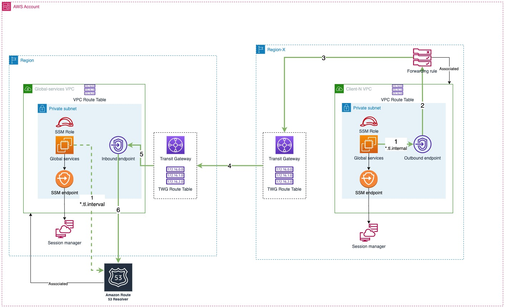

# VPC Peering & Route 53 Resolver

In this Project, you will create a Global Transit Network to allow N different countries to communicate with each other through AWS' private network. You will not only set up network routes across the globe, but you will also have to implement a private global DNS solution. Although intermediate to advanced knowledge on networking on AWS is a plus, anyone can benefit from this session as you will go from the very basics (e.g., calculating CIDR ranges, creating VPCs from scratch) to more advanced concepts (e.g., setting up transit networks and a global DNS solution).


## What are we going to learn

- Calculate network and subnet addresses that expand multiple countries
- Architect and implement global network routes using Transit Gateways
- Set up inter-region peering connections
- Leverage AWS PrivateLink to securely access your private network
- Use Route53 Inbound and Outbound Resolvers to centralize DNS resolution
- Implement Forwarding rules to send DNS resolution requests from all around the globe to a central location

## Architecture


***Notes: In this Architecture we only implement only 1 client-region. But, bare in mind, we can implement as many client-regions as we want as long as we use the same architecture.***

### Query dns from Client-N VPC (Solid green arrows)

- (1) A DNS query request (`*.tl.internal`) is sent to Outbound endpoint
- (2) Outbound endpoint will reference forwarding rule which was associated with the VPC
- (3,4,5) The query request will be forwarded to Inbound endpoint via VPC-Peering connection
- (6) The Resolver (which was associated with the Global-Services VPC) resolves the request and return the answer to EC2 instance via the same path in reverse.

### Query dns from Global-Services VPC (Dashed green arrows)

- (1) The DNS query request will be sent directly to the Resolver and get the answer

## How to test it out?

1. Prepare `local.tfvars` which contents aws credentials account
2. Provision infrastructure
```
terraform init
terraform apply --var-file local.tfvars
```
3. Login AWS Console
4. Choose region (`us-east-1`, `us-west-2`)
5. Go to `Session Manager` and start new session -> choose either global-services instance or client instance.
6. Ping other instance
```
# From global-service instance
ping client.tl.internal
# From client instance
ping gs.tl.internal
```

***Note: If you provision more client-regions, from your client-instance, you can only ping global-services-instance and vice versa. That means you're NOT able to ping client-instance to client-instance***

## Clean-up resources
```
terraform destroy --var-file local.tfvars
```
